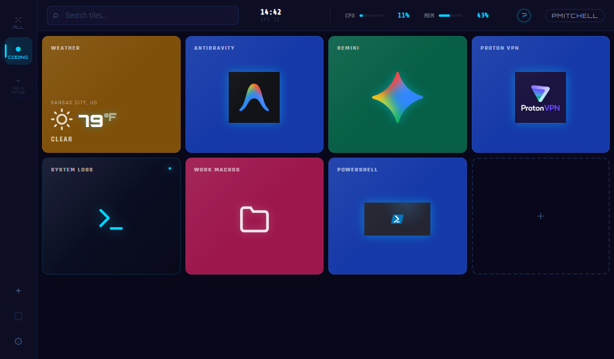
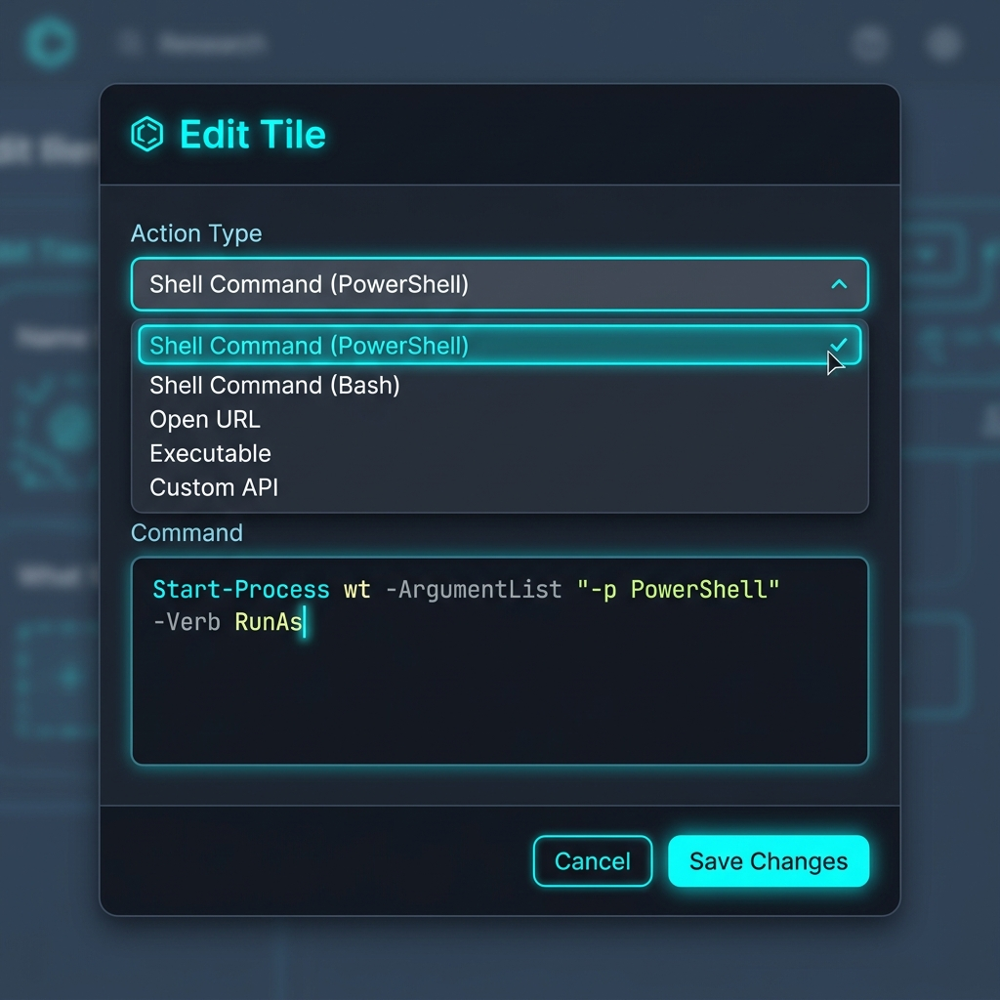
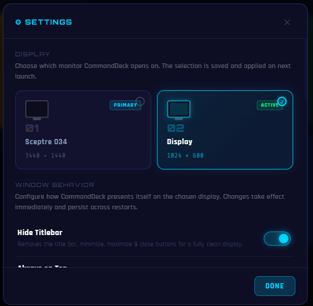

# ⬡ CommandDeck

> A tile-based hotkey dashboard for Windows 11 — launch apps, monitor live system stats, control media, and display real-time information from a single customizable interface.  Free Open Source software to be utilized with cheap 7 inch screens like https://a.co/d/05MqhGJp.


---

## ✨ Features

| Feature | Details |
|---|---|
| 🕐 **Live Clock** | Realtime digital clock with date display |
| 🌤 **Weather Tile** | Current temp & conditions via [Open-Meteo](https://open-meteo.com/) (no API key required) |
| 📊 **System Stats** | CPU load (with sparklines), temp, speed, GPU data, and RAM usage |
| 🎵 **Media Controls** | Play/Pause, Next/Prev, Mute, Volume via `user32` P/Invoke |
| 🚀 **Shell Commands** | Dedicated PowerShell script support with proper character escaping |
| 📷 **Camera Streams**| Display live RTSP camera feeds (converted to MJPEG) |
| 📑 **Multi-Page Layout**| Organize tiles into custom pages, assign to multiple pages, and drag-and-drop to reorder |
| 🛠 **Utility Tools** | Quick header access for Touchscreen realignment helper |
| 📜 **Diagnostic Logs** | Centralized dashboard-mounted system log viewer |
| 🎨 **Fully Editable** | Right-click any tile to edit label, icon, color, or behavior |
| 📐 **Responsive Grid** | Fluid neon layout optimized for small 7-inch auxiliary displays |

---

## 🖥 Screenshots



*The v1.1 Dashboard featuring neon-cyan headers, live system stats, and the new Touch Fix utility button.*



*Dedicated Shell Command support with proper PowerShell cmdlet handling and character escaping.*



*The new Settings dashboard allowing monitor selection and persistent configuration management.*

---

## 🚀 Getting Started

### Prerequisites

- [Node.js](https://nodejs.org/) v18+
- Windows 10 / 11

### Install & Run

```bash
git clone https://github.com/legendary034/CommandDeck.git
cd CommandDeck
npm install
npm run dev
```

### Build Installer

```bash
npm run build
# Output: dist/CommandDeck Setup x.x.x.exe
```

---

## 🧩 Tile Types

### 🕐 Clock
Displays the current time (HH:MM) and date. Updates every second using the system clock.

### 🌤 Weather
Fetches live weather from [Open-Meteo](https://open-meteo.com/) — no API key needed.  
On first launch, click the tile and enter your city name to configure.

### 📊 Stat
Displays a live system metric. Available stats:

| `stat` key | Description |
|---|---|
| `cpuLoad` | CPU utilization % (with sparkline graph) |
| `cpuTemp` | CPU package temperature (°C) |
| `cpuSpeed` | CPU clock speed (MHz) |
| `memUsed` | RAM usage % |
| `gpuTemp` | GPU temperature (°C) |
| `cpuPower` | CPU power draw (W) |
| `memClock` | Memory clock speed (MHz) |

Values turn **yellow** at warning thresholds and **red** (pulsing) at critical thresholds.

### 🎵 Media
Sends a Windows media key via `user32.dll`. Available actions:

| `action` | Function |
|---|---|
| `play-pause` | Toggle play/pause |
| `next` | Next track |
| `prev` | Previous track |
| `mute` | Toggle mute |
| `vol-up` / `vol-down` | Volume control |

### 🚀 Action (App Launcher)
Used for standard application launching by path.

- Set `path` to an `.exe`, `.bat`, or shortcut (e.g. `C:\Windows\notepad.exe`)  
- Supports "Magic Paste": Paste a shortcut with arguments into the path field, and I'll split them for you automatically!

### 💻 Shell (PowerShell)
Dedicated tile type for complex PowerShell cmdlets and scripts.

- Set `command` to your raw script (e.g. `Start-Process wt -ArgumentList "-p PowerShell" -Verb RunAs`)  
- Handles quotes and special characters reliably via internal escaping.  
- Bypasses the auto-splitting logic to ensure your cmdlet remains intact.

### 📷 Camera
Displays a live RTSP camera stream on the dashboard.

- Automatically converts RTSP to MJPEG using `ffmpeg` for low-latency browser display.
- Efficient background processing: streams automatically stop when the page is not active to save resources.

---

## ⚙ Configuration

All tile configuration is stored in `config/tiles.json`. You can edit it directly or use the in-app editor (right-click any tile → **Edit Tile**).

### Tile Schema

```json
{
  "id": "my-tile",
  "type": "action",
  "size": "small",
  "color": "#1539a8",
  "label": "NOTEPAD",
  "icon": "edit",
  "path": "notepad.exe"
}
```

| Field | Values | Description |
|---|---|---|
| `type` | `action` `shell` `media` `stat` `clock` `weather` `camera` | Tile behavior |
| `size` | `small` `wide` `tall` `large` | Grid span |
| `categories` | Array of strings | Pages the tile appears on |
| `color` | Any hex color | Background color |
| `icon` | See icon list below | SVG icon name |
| `path` | File path string | App to launch (`action` type only) |
| `command` | PowerShell/CMD string | Script to run (`shell` type only) |
| `stat` | See stat keys above | Live metric to display |
| `action` | See media actions above | Media key to send |
| `streamUrl` | RTSP URL string | Camera stream URL (`camera` type only) |

### Available Icons

`volume-x` · `volume-2` · `skip-back` · `skip-forward` · `play` · `pause` · `gamepad` · `music` · `flame` · `radio` · `layers` · `folder-open` · `settings` · `terminal` · `cpu` · `moon` · `sun` · `cloud` · `cloud-rain` · `cloud-snow` · `zap` · `edit` · `trash` · `search` · `menu` · `plus` · `x` · `check` · `alert-triangle` · `minimize` · `maximize`

---

## 🗂 Project Structure

```
CommandDeck/
├── electron.cjs          # Main process — window, IPC, stats polling, media keys
├── preload.cjs           # contextBridge API (secure renderer ↔ main)
├── index.html            # App shell — titlebar, sidebar, header, tile canvas
├── src/
│   ├── app.js            # Renderer — tile engine, stats, weather, edit modal
│   ├── style.css         # CRT/neon design system
│   └── icons.js          # SVG icon library (25+ icons)
├── config/
│   └── tiles.json        # Tile layout config (user-editable)
└── package.json
```

---

## 🛠 Tech Stack

- **[Electron 33](https://electronjs.org/)** — Chromium + Node.js desktop shell
- **[systeminformation](https://systeminformation.io/)** — Cross-platform system metrics
- **[Open-Meteo API](https://open-meteo.com/)** — Free weather, no API key
- **[Orbitron](https://fonts.google.com/specimen/Orbitron)** + **[Share Tech Mono](https://fonts.google.com/specimen/Share+Tech+Mono)** — Google Fonts
- Vanilla HTML / CSS / ES Modules (no frontend framework)

---

## 📄 License

MIT © 2024 CommandDeck Contributors
